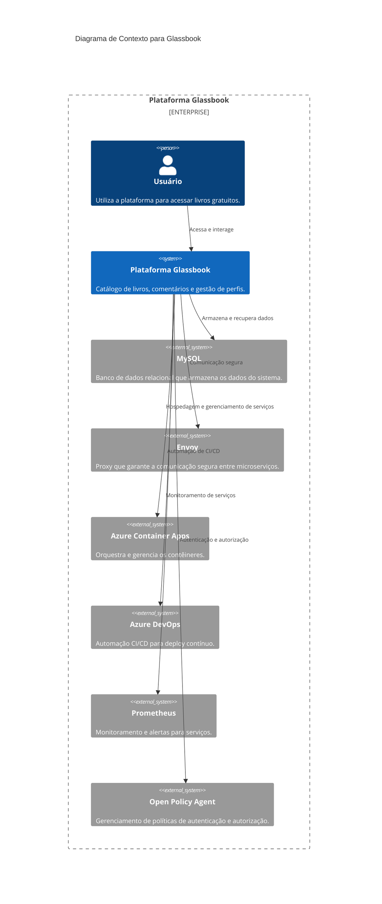
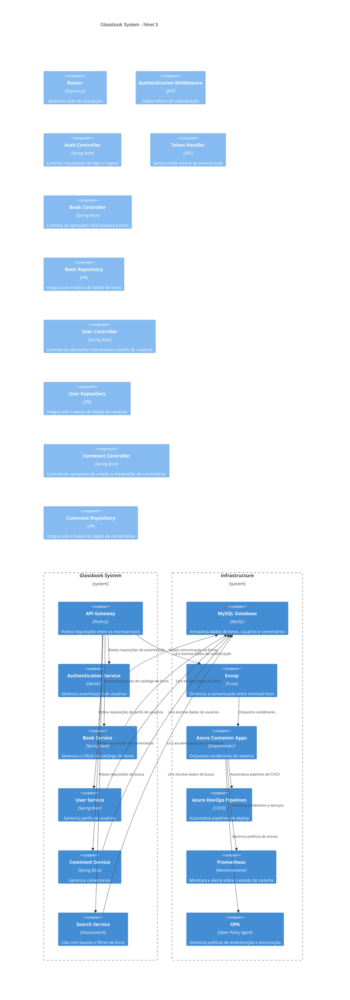
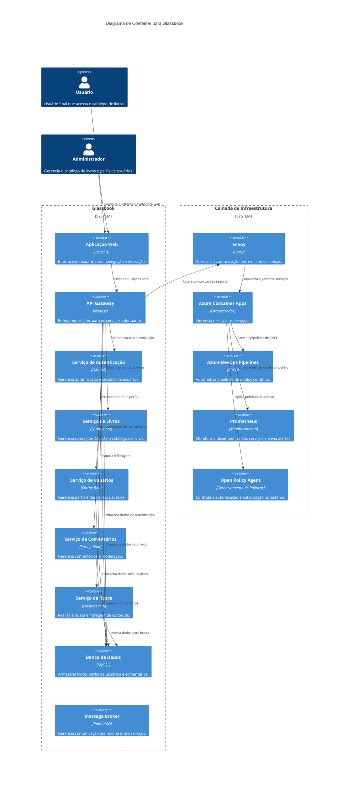

Aqui está o texto formatado em Markdown:

---

# Documentação Arc42 – Glassbook

## 1. Introdução e Objetivos

### 1.1 Propósito
O Glassbook é uma plataforma digital que permite o acesso gratuito a uma ampla biblioteca de livros, promovendo uma comunidade interativa de leitores. A plataforma visa democratizar o acesso à literatura, proporcionando um espaço onde os usuários possam compartilhar experiências, discutir obras e explorar novas tendências literárias.

### 1.2 Visão
O Glassbook tem a ambição de se tornar uma referência global para leitores que buscam conteúdo literário de alta qualidade e gratuito. Além disso, a plataforma se posiciona como uma rede social de leitores, incentivando interações entre os usuários e criando uma experiência colaborativa e rica.

### 1.3 Público-Alvo
- **Leitores gerais:** Pessoas que buscam uma ampla seleção de livros sem custos.
- **Fãs de literatura:** Leitores engajados que desejam interagir com outros usuários, compartilhar suas leituras e discutir obras literárias.
- **Contribuidores ativos:** Usuários que querem participar ativamente da plataforma, colaborando com conteúdo ou engajando-se na comunidade.

---

## 2. Restrições

### 2.1 Restrições Técnicas
- **Arquitetura baseada em microserviços:** A plataforma seguirá uma arquitetura de microserviços, garantindo modularidade, escalabilidade horizontal e facilidade de manutenção e evolução. Cada microserviço será responsável por uma funcionalidade específica, como autenticação, gerenciamento de perfis ou armazenamento de livros. 
- **Orquestração com Azure Container Apps:** O Azure Container Apps será utilizado para gerenciar, automatizar e escalar os microserviços de forma eficiente. A orquestração permitirá balanceamento de carga, recuperação automática em caso de falhas e gerenciamento de contêineres distribuídos em diferentes regiões geográficas. 
- **Envoy como proxy de comunicação:** O Envoy será utilizado para gerenciar a comunicação entre os microserviços, assegurando tráfego eficiente, seguro e com baixa latência. Ele também ajudará no roteamento e observabilidade da comunicação entre os serviços. 
- **Banco de dados MongoDB e SQL:** Para o armazenamento de dados, a plataforma utilizará uma combinação de MongoDB, para dados não estruturados como interações e comentários, e SQL (MySQL), para dados estruturados, como o catálogo de livros e perfis de usuários. A utilização de ambos permitirá flexibilidade e desempenho na manipulação dos dados. 
- **Automação com Azure DevOps:** Pipelines de CI/CD serão automatizados utilizando Azure DevOps, garantindo que o desenvolvimento, testes e deploy ocorram de maneira contínua e sem interrupções. Isso permite uma rápida entrega de novas funcionalidades e correções, além de reduzir o tempo de downtime. 
- **Monitoramento com Prometheus:** O sistema será monitorado em tempo real por meio do Prometheus, que coletará métricas de desempenho, disponibilidade e falhas, permitindo a identificação proativa de problemas e alertas para os administradores. 
- **Gerenciamento de políticas com Open Policy Agent (OPA):** A segurança será reforçada pelo OPA, que controlará políticas de autenticação e autorização, garantindo que apenas usuários devidamente autenticados possam acessar os recursos apropriados.  

### 2.2 Restrições Organizacionais
- **Multirregionalidade:** O sistema deve ser acessível globalmente, com alta disponibilidade e desempenho otimizado para diferentes localizações. 
- **Suporte contínuo à comunidade de contribuidores:** Os desenvolvedores devem fornecer ferramentas e documentação para que novos contribuidores possam colaborar de maneira ágil e sem barreiras. 

### 2.3 Restrições Financeiras
- **Otimização de custos:** O uso de infraestrutura na nuvem deve ser minimizado através de técnicas como automação de CI/CD com Azure DevOps e monitoramento com Prometheus, evitando ociosidade e sobrecarga desnecessária. 

---

## 3. Contexto do Sistema
## Diagrama de Contexto

### 3.1 Descrição Geral
O Glassbook oferece uma plataforma onde os usuários podem acessar, buscar e interagir com livros gratuitamente. Além disso, a plataforma permite que os usuários criem perfis, comentem em obras e sigam tendências literárias. O sistema é composto por diversos microserviços responsáveis por funcionalidades como autenticação, armazenamento de livros, gerenciamento de perfis e discussões literárias. 

- Usuários finais interagindo com a plataforma através da interface web. 
- Comunicação com serviços externos, como serviços de autenticação (OAuth), bases de dados (MySQL), monitoramento (Prometheus) e automação de deploy (Azure DevOps). 
- Microserviços internos gerenciados pelo Azure Container Apps, com o Envoy fazendo a orquestração segura. 

### 3.3 Interfaces Externas
- **MySQL:** Banco de dados relacional que armazena informações sobre livros, usuários e interações.
- **Envoy:** Proxy de comunicação entre os microserviços, garantindo segurança e otimização do tráfego.
- **Azure Container Apps:** Responsável pela orquestração e escalabilidade dos microserviços.
- **Azure DevOps:** Automação de pipelines de CI/CD, permitindo implantações contínuas. 
- **Prometheus:** Ferramenta de monitoramento usada para coletar métricas e gerar alertas em tempo real.
- **Open Policy Agent (OPA):** Usado para gerenciar políticas de autenticação e autorização, garantindo que os usuários autenticados possam acessar os recursos apropriados.

## Diagrama de Sistema

---

## 4. Visão de Solução
A plataforma Glassbook adota uma arquitetura de microserviços, com cada microserviço sendo responsável por uma parte específica da funcionalidade, como autenticação, gerenciamento de livros, interação social, etc. O Azure Container Apps orquestra esses microserviços, escalando automaticamente conforme a demanda, enquanto o Envoy gerencia a comunicação segura entre eles.

## Diagrama de Contêiner

---

## 5. Visão de Componentes e Conectores
Cada microserviço é encapsulado de forma independente e pode ser escalado horizontalmente. Os principais componentes incluem:
- **Serviço de Autenticação:** Gerencia o login, registro e autenticação de usuários, integrado ao OAuth2. 
- **Serviço de Livros:** Responsável pelo armazenamento e recuperação de dados de livros, incluindo detalhes de obras e metadados.
- **Serviço de Perfis de Usuário:** Gerencia perfis, configurações de usuários e preferências. 
- **Serviço de Comentários e Discussões:** Permite que os usuários façam comentários e participem de discussões relacionadas aos livros.
- **Serviço de Busca:** Fornece funcionalidade de pesquisa para que os usuários encontrem livros por título, autor ou categoria.

A comunicação entre os componentes é feita por meio de APIs RESTful e gRPC, gerenciada pelo Envoy. 

---

## 6. Visão de Implementação
Os microserviços são implementados em uma linguagem de programação apropriada (Node.js). O código é organizado em módulos claros, facilitando a manutenção e a evolução. Cada microserviço é encapsulado em contêineres Docker e implantado no Azure Container Apps, enquanto o Azure DevOps automatiza o pipeline de integração e entrega contínua (CI/CD). 

---

## 7. Decisões Arquiteturais Importantes
- **Uso de microserviços:** Decisão tomada para garantir escalabilidade e facilitar a manutenção e evolução do sistema, além de permitir o desenvolvimento paralelo por diferentes equipes.
- **Orquestração com Azure Container Apps:** Escolhido para gerenciar a infraestrutura de contêineres de maneira eficiente, suportando escalabilidade horizontal e alta disponibilidade. 
- **Envoy como proxy:** Optou-se pelo Envoy para garantir uma comunicação segura, eficiente e com baixa latência entre os serviços.
- **Monitoramento com Prometheus:** Decisão estratégica para garantir que o sistema seja monitorado em tempo real, permitindo a identificação proativa de problemas de desempenho ou disponibilidade.

---

## 8. Desdobramentos de Componentes
Cada microserviço será implantado em contêineres Docker dentro de clusters Azure Container Apps. Esses contêineres serão distribuídos em múltiplas regiões geográficas para garantir baixa latência e alta disponibilidade. A autenticação será gerenciada pelo OAuth2 com políticas de autorização controladas pelo OPA. 

O processo de deploy será automatizado por meio de Azure DevOps, garantindo que novos recursos e correções sejam implementados de maneira contínua sem interrupção dos serviços. 

---

## 9. Aspectos de Qualidade

### 9.1 Aplicação da ISO 25010 - Qualidade de Software
#### Funcionalidade
- **Adequação Funcional:** O sistema deve fornecer corretamente as funcionalidades para acessar, buscar, interagir e armazenar livros, garantindo que todas as funcionalidades prometidas estejam disponíveis e operacionais. 

#### Confiabilidade
- **Maturidade:** A plataforma deve estar suficientemente testada para garantir que funcione sem falhas em condições normais de operação.
- **Disponibilidade:** A plataforma deve garantir uma alta disponibilidade global, especialmente por ser uma aplicação de alcance multirregional. 
- **Tolerancia a falhas:** Em caso de falhas de microserviços ou serviços externos, o sistema deve ser capaz de se recuperar automaticamente sem afetar a experiência do usuário. 
- **Recuperabilidade:** No caso de falha de serviços externos ou interrupções, o sistema deve garantir uma recuperação rápida. 

#### Desempenho
- **Eficiência no uso de recursos:** O sistema deve otimizar o uso de recursos de infraestrutura em nuvem para evitar sobrecargas e minimizar custos. 
- **Tempo de Resposta:** O sistema deve ser capaz de responder rapidamente a todas as solicitações, com tempo de resposta otimizado, mesmo em condições de alta carga. 
- **Escalabilidade:** Deve ser garantido que o sistema possa escalar horizontalmente com o Azure Container Apps para lidar com o crescimento da base de usuários. 

#### Segurança
- **Confidencialidade:** Toda comunicação entre usuários e microserviços deve ser criptografada via TLS, garantindo a confidencialidade dos dados transmitidos. 
- **Autenticação e autorização:** O sistema deve garantir que apenas usuários autenticados possam acessar os recursos adequados.
- **Auditoria e rastreamento:** Todas as ações críticas devem ser registradas para auditorias futuras, como tentativas de acesso não autorizado. 
  
#### Manutenibilidade
- **Modularidade:** A arquitetura de microserviços garante a separação clara de funcionalidades, facilitando o desenvolvimento e a manutenção de diferentes partes do sistema. 
- **Facilidade de Análise:** O código deve ser organizado de maneira que facilite a análise de defeitos e a implementação de melhorias, seguindo o Domain-Driven Design (DDD).
- **Modificabilidade:** O sistema deve suportar modificações e atualizações contínuas sem causar interrupções no serviço. 

#### Portabilidade
- **Adaptabilidade:** O sistema deve ser facilmente adaptável para novos ambientes de execução, com contêineres Docker para facilitar a portabilidade. 
- **Facilidade de Instalação:** A automação com Azure DevOps deve garantir que novos ambientes possam ser configurados e instalados sem esforço excessivo.  

---

## 10. Quality Scenarios

### Confiabilidade
- **Cenário:** Um servidor da nuvem falha, interrompendo o acesso a um dos microserviços.
  - **Resposta:** O sistema deve redirecionar o tráfego para um microserviço em uma região diferente sem impactar a experiência do usuário. 
  - **Métrica:** A indisponibilidade do sistema não deve exceder 1 minuto por falha. 

### Eficiência no uso de recursos
- **Cenário:** Durante um mês de baixa demanda, os custos de infraestrutura devem ser otimizados.
  - **Resposta:** A plataforma deve reduzir automaticamente o número de instâncias ativas para diminuir os custos com a nuvem. 
  - **Métrica:** Redução de custos em até 30% nos períodos de baixa atividade. 

### Segurança
- **Cenário:** Um ataque de força bruta tenta acessar contas de usuários. 
  - **Resposta:** 100% de ataques detectados devem ser bloqueados, e as tentativas registradas.
    
---

## 10.1 Árvore de Qualidade baseada na ISO 25010
- **Qualidade Principal:** Confiabilidade
  - **Subárea:** Disponibilidade (99,95% do tempo)
    - **Métrica:**  O sistema deve estar disponível 99,95% do tempo. 
  - **Subárea:** Recuperabilidade (recuperação em menos de 1 minuto)
    - **Métrica:** O sistema deve se recuperar de falhas em menos de 1 minuto. 
- **Qualidade Principal:** Eficiência no Uso de Recursos
  - **Subárea:** Otimização de Custos (redução de 30%)
       - **Métrica:** Redução de 30% nos custos de infraestrutura em períodos de baixa demanda.
  - **Subárea:** Escalabilidade (escalabilidade horizontal até 10x)
     - **Métrica:** O sistema deve escalar horizontalmente com um aumento de usuários em até 10x sem degradação de desempenho. 
- **Qualidade Principal:** Segurança
  - **Subárea:** Confidencialidade de Dados (100% criptografado com TLS)
      - **Métrica:** 100% das comunicações devem ser criptografadas com TLS. 
  - **Subárea:** Controle de Acesso (tentativas de acesso bloqueadas e registradas)
      - **Métrica:** Todas as tentativas de acesso não autorizado devem ser bloqueadas e registradas. 

---

## 10.2 Riscos Técnicos e Dívidas Técnicas Adicionais com base na ISO
- **Custos elevados de infraestrutura:** À medida que a plataforma cresce, os custos de escalabilidade automática podem se tornar insustentáveis. Isso exige uma análise contínua de otimização de recursos, especialmente para cenários de alta demanda, evitando sobrecarga financeira.
  
- **Dependência de serviços externos:** Se os serviços de autenticação via OAuth ou monitoramento com Prometheus tiverem problemas, pode haver um impacto direto na segurança e desempenho do sistema. 

- **Manutenção complexa de microserviços:** À medida que a arquitetura de microserviços cresce, há o risco de que a manutenção e as atualizações se tornem mais difíceis, exigindo esforço adicional para garantir que cada microserviço seja devidamente testado e implementado.
  
- **Falhas de serviços externos:** Dependência de terceiros, como provedores de nuvem ou serviços de autenticação, pode representar um risco de indisponibilidade.
  
- **Crescimento exponencial de usuários:** Picos de demanda podem sobrecarregar os recursos da plataforma, mesmo com escalabilidade automatizada. A mitigação inclui uma estratégia de balanceamento de carga eficaz e provisionamento de recursos redundantes. 

- **Custos elevados com escalabilidade:** À medida que a plataforma cresce, os custos com infraestrutura também podem crescer, necessitando de otimizações contínuas de uso de recursos na nuvem.
  
---

## 11. Requisitos de Hardware e Software

### 11.1 Requisitos de Hardware
- **Servidores:** Servidores que suportem a orquestração de contêineres com Azure Container Apps, com capacidade de escalabilidade horizontal. 
- **Redes:** Redes de baixa latência para garantir o rápido tráfego entre microserviços. 

### 11.2 Requisitos de Software
- **Azure Container Apps:** Orquestração.
- **Docker:** Contêinerização.
- **Envoy:** Comunicação segura.
- **Azure DevOps:** Automação de CI/CD.

--- 
## 12. Glossário

Aqui está o glossário para o documento:

---

# Glossário

- **Azure Container Apps:** Serviço do Azure que permite a orquestração de contêineres de maneira escalável e distribuída, facilitando a implantação e gerenciamento de microserviços.

- **CI/CD (Continuous Integration/Continuous Delivery):** Conjunto de práticas que permite a integração contínua de código em repositórios e entrega rápida de novas versões de software, reduzindo o tempo de deploy e aumentando a eficiência.

- **DevOps:** Conjunto de práticas que une o desenvolvimento (Dev) e operações (Ops), com foco na automação e monitoramento para oferecer melhorias contínuas no desenvolvimento e entrega de software.

- **Domain-Driven Design (DDD):** Abordagem de desenvolvimento de software que prioriza a modelagem de acordo com os domínios de negócios específicos para criar sistemas modulares e fáceis de entender.

- **Envoy:** Proxy de comunicação utilizado para gerenciar o tráfego entre microserviços, fornecendo baixa latência, segurança e otimização do tráfego.

- **gRPC:** Protocolo de comunicação que facilita a troca de dados entre sistemas distribuídos, utilizando chamadas de função remota (RPC) e oferecendo baixa latência e alta performance.

- **MerMair (Diagrama de MerMair):** Ferramenta de diagramação usada para visualizar entidades e relacionamentos em sistemas complexos, frequentemente utilizada para modelagem de dados.

- **MongoDB:** Banco de dados NoSQL orientado a documentos, ideal para armazenar dados não estruturados, como interações e comentários de usuários.

- **OAuth2:** Protocolo de autenticação que permite acesso seguro a sistemas sem expor as credenciais do usuário, frequentemente usado para autenticação em APIs.

- **Open Policy Agent (OPA):** Ferramenta de gerenciamento de políticas que permite definir e aplicar regras de acesso e autorização de maneira centralizada e segura.

- **Pipeline de CI/CD:** Fluxo de trabalho automatizado que integra e entrega código continuamente, realizando testes e deploy em ambientes de produção.

- **Prometheus:** Ferramenta de monitoramento que coleta métricas de desempenho e disponibilidade em tempo real, usada para identificar proativamente problemas no sistema.

- **SQL (Structured Query Language):** Linguagem padrão para gerenciamento e manipulação de dados em bancos de dados relacionais, como MySQL.

- **TLS (Transport Layer Security):** Protocolo de criptografia que assegura a transmissão segura de dados pela internet, garantindo confidencialidade e integridade.

