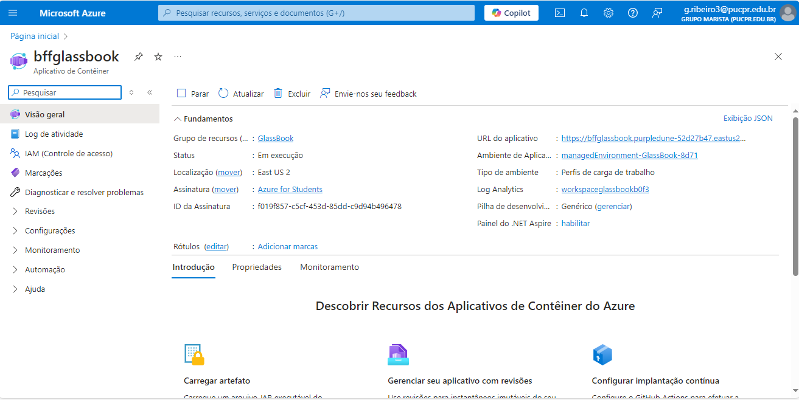
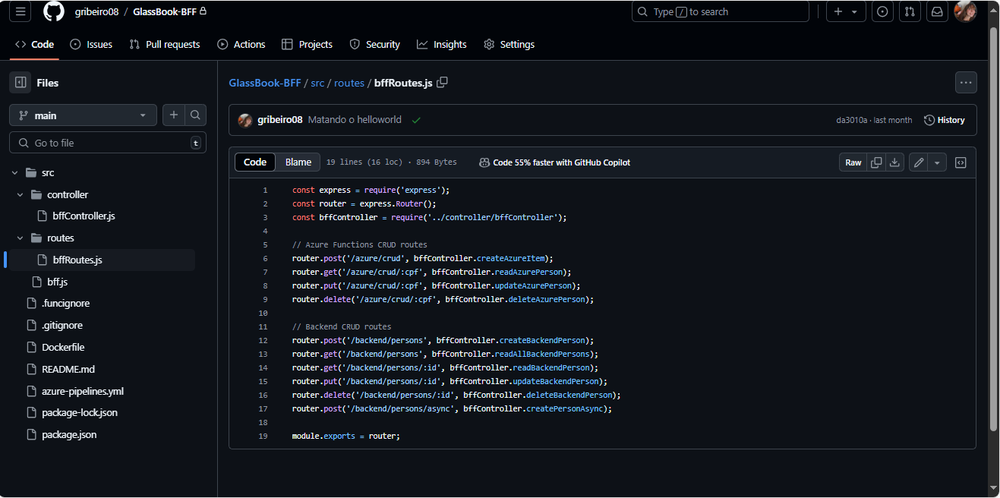

#API Gateway AWS (Request para o BFF)

#BFF no Azure Container Apps ( Request para o Microsserviço e Azure Function)

#Microsserviço utilizado de Clean Architecture e Vertical Slice e Camadas, conectando ao banco de dados SQL Server.

#Azure Functions conectando ao banco de dados MongoDB.

#Eventos entre Microsserviço e Azure Functions via Azure Service Bus.

#Evidencia de todos os códigos fontes (BFF, Microsserviço e Azure Function)

#Evidencia de Request e Response no API gateway de dado INSERIDO em banco de dados (evidência do banco de dados também).

#Evidencia do evento do Azure Service Bus.

#Teste unitário de arquitetura. 

